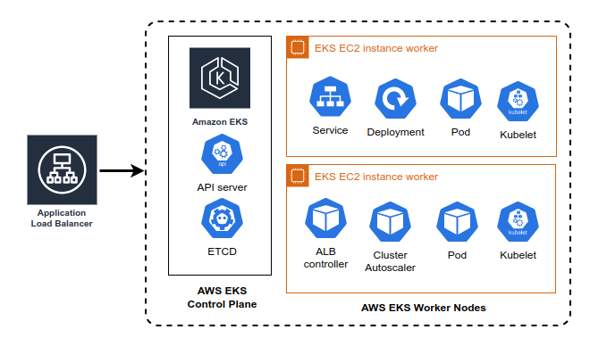

## Description
Walkthrough of the steps taken to create the demo EKS cluster: `eks-cluster-demo`



Guide contains:

- eksctl commands to create VPC, EKS Cluster, Nodes, IAM service accounts.
- Add-on installations for EBS, helm installation for Fluentbit
- Installations for Cluster Autoscaler, AWS Ingress Controllers

## Pre-requisites
Before proceeding, install the following versions on your local machine:

- eksctl version = 0.138.0
- awscli version = 2.11.17
- helm version = v3.11.3


## EKS Cluster creation
Use the `eksclt create` command to create the EKS cluster, with new VPC, Node groups, including the service accounts you want to use on each namespace. Service accounts on default namespace are used for system related permissions. 

eksctl will create an OIDC for assigning permissions to service accounts. 

Ensure that IAM Policy documents are already created first before creating the cluster. See the YAML file `eks-cluster-demo.yaml`, which expects the ARN of the IAM policy created to be assigned for each service account.
```
iam:
  withOIDC: true
  serviceAccounts:
  - metadata:
      name: sa-storage-controller
      namespace:  kube-system 
      labels: {serviceaccount: "eks-cluster-demo"}
    attachPolicyARNs:
    - "arn:aws:iam::aws:policy/service-role/AmazonEBSCSIDriverPolicy"
```

Run the following command to create the EKS cluster. This also creates the OIDC and Service Accounts:
```
eksctl create cluster -f cluster/eks-cluster-demo.yaml
```

If you need to add more service account in the future, update the YAML and run:
```
eksctl create iamserviceaccount --config-file=cluster/eks-cluster-demo.yaml
```

If you need to add/modify the nodegroup, edit the YAML to add a new node group and delete the old group. You can't modify the current nodegroup.
```
eksctl create nodegroup --config-file=cluster/eks-cluster-demo.yaml
eksctl delete  nodegroup --cluster=eks-cluster-demo --name=nodegroup-spot-1 --disable-eviction --parallel=2
```

## Connect to EKS
Run the following to add the demo EKS to your local aws eks config
```
aws eks update-kubeconfig --region ap-southeast-2 --name eks-cluster-demo
```

Test connection
```
kubectl get nodes
kubectl get namespaces
```

## Install the metrics server
To have CPU and RAM usage metrics shown on Rancher Web UI, install the metrics server
```
kubectl apply -f cluster/metrics-server.yaml
```

## Install EBS Driver to the Cluster
Check if EBS addon is installed
```
eksctl get addon --name aws-ebs-csi-driver --cluster eks-cluster-demo
```

Install the EBS driver
```
aws eks describe-addon-versions --addon-name aws-ebs-csi-driver
eksctl create addon --name aws-ebs-csi-driver --cluster eks-cluster-demo
```

Check if the created EBS CSI controller and node pods are present.
```
kubectl get pods -n kube-system | grep ebs 
```

## Create StorageClass for EBS
This will allow the containers to use GP3 EBS backed storage for their volumes.

Ensure that the service account for storage controller is created before running this command.
```
$ kubectl apply -f cluster/ebs-storage-eks-v2.yaml
---
apiVersion: storage.k8s.io/v1
kind: StorageClass
metadata:
  name: demo-ebs-sc
provisioner: ebs.csi.aws.com
volumeBindingMode: WaitForFirstConsumer
parameters:
  type: gp3
```

## Install the AWS cluster autoscaler pod
Ensure that you create IAM service account for the cluster-autoscaler.

Ensure that the service account has proper IAM policy permission to add/modify the size of the nodegroup. See the YAML file you used for the `eksctl` command. 

Reference link: https://github.com/kubernetes/autoscaler/blob/master/cluster-autoscaler/cloudprovider/aws/README.md

Deploy the cluster autoscaler pod. Modify the settings as required, including the service account, the auto-discovery tags, the scale-down timers, etc. See the `Deployment` definition for the additional command arguments.
```
  - --scale-down-delay-after-add=20m
  - --scale-down-unneeded-time=20m
  - --scale-down-delay-after-delete=10m
  - --node-group-auto-discovery=asg:tag=k8s.io/cluster-autoscaler/enabled=true,k8s.io/cluster-autoscaler/eks-cluster-demo=owned
``` 

Reference link for FAQs: https://github.com/kubernetes/autoscaler/blob/master/cluster-autoscaler/FAQ.md
```
kubectl apply -f cluster/cluster-autoscaler.yaml
```

Check if the cluster-autoscaler pod is running
```
kubectl get pods | grep cluster-autoscaler
```

Check for the flags you enabled/modified on the YAML (example scale-down flags)
```
$ kubectl logs -f cluster-autoscaler-xxxxx| grep scale-down-delay

I0607 22:09:35.422398    FLAG: --scale-down-delay-after-failure="3m0s"
I0607 22:09:35.422379    FLAG: --scale-down-delay-after-add=20m0s"
I0607 22:09:35.422383    FLAG: --scale-down-delay-after-delete="10m0s"

```

Test if the cluster-autscaler works:
```
kubectl apply -f scaletest.yaml # deploy any image and increase the number of replicas
kubectl delete -f scaletest.yaml # delete it after you are done testing
```

## Install the aws-loadbalancer-controller pod
AWS Load Balancer Controller is required for EKS to update target-group/paths/routes/rules on the AWS ALB. 

This installation requires Helm. Add the AWS Helm repo and install the aws-loadbalancer-controller.

Ensure that you have created the load balancer service account with proper IAM permissions. 
```
helm repo add eks https://aws.github.io/eks-charts
helm repo update
kubectl apply -k "github.com/aws/eks-charts/stable/aws-load-balancer-controller//crds?ref=master"
helm install aws-load-balancer-controller eks/aws-load-balancer-controller \
  -n kube-system \
  --set clusterName=eks-cluster-demo\
  --set serviceAccount.create=false \
  --set serviceAccount.name=sa-load-balancer-controller
```

Check if the aws-load-balancer-controller pod is deployed:
```
kubectl get deployment -n kube-system aws-load-balancer-controller
```

## Create ingress ALB from Kubernetes
This will create Application Load Balancer to be used for the EKS cluster.
```
kubectl apply -f ingress/namespace.yaml
kubectl apply -n ingress -f ingress/demo-ingress.yaml 
```

Note:

 - this will create an ALB without any backend 
 - ensure that the annotation `alb.ingress.kubernetes.io/group.name` is the same value on each ingress YAML definition if you want them to share the ALB across all namespaces
 - Ensure proper unique order number on the `alb.ingress.kubernetes.io/group.order` annotation - failure to do so will have a possibility of replacing the actual load labancer with a new one
 - If you use this ingress for routing on all namespaces, you will need to deploy an Ingress definition on each namespace/service to configure routing
 - Ensure correct `namespace` is defined when creating a secondary ingress entry - failure to do so will have a possibility of replacing the actual load labancer with a new one
 - path/URL/host configuration will depend on each application domain/path routing


## Install aws eks fluentbit (default namespace)
Fluentbit is used to capture the container logs and send them to Kibana for logging. 
Ensure that the assume role policy for the service account is created from the eksctl IAM service account creation.

Installation requires helm from AWS repo. Modify the `deploy/fluentbit/fluentbit-values.yaml` as needed. 
```
helm upgrade --install fluent-bit eks/aws-for-fluent-bit \
    --values=fluentbit-values.yaml \
    --set serviceAccount.create=false \
    --set serviceAccount.name=fluent-bit-aws-for-fluent-bit \
    --set image.tag=2.31.10 \
    --namespace default
```

Fluentbit will not work out of the box since the log format is not Docker format. 
Replace the configmap values by add the fluent-bit config files inside the configmap folder and applying them.
```
kubectl get configmap
kubectl describe configmap fluent-bit-aws-for-fluent-bit 
kubectl create configmap fluent-bit-aws-for-fluent-bit --from-file deploy/fluentbit/configmap/ --dry-run=client -o yaml | kubectl replace  -f -
```

- This will replace the default Fluentbit configuration created by the helm installation.
- Delete the fluent-bit pods to restart them and apply the new config.
- Login to Kibana to check if the created 

## Install ExternalSecrets to sync Secrets to EKS
External Secrets Operator is a Kubernetes operator that integrates external secret management systems like AWS Secrets Manager, including AWS Parameter Store. This will sync the secrets from AWS and injects them as Secrets inside the kubernetes namespace. The secrets will be synced in regular intervals

Reference page: https://github.com/external-secrets/external-secrets

Reference version used: https://external-secrets.io/v0.8.1/

Start the install using Helm and include the CRDs
```
helm repo add external-secrets https://charts.external-secrets.io
helm install external-secrets external-secrets/external-secrets --set installCRDs=true
```

Check for the externalSecrets pods:
```
kubectl get pods | grep external-secrets
```

## How to use ExternalSecrets with AWS Secrets Manager or Parameter Store

- Create an IAM Service account for specific namespace. 
- Ensure that the IAM policy for the service account is allowed to access specific AWS Secret Manager or AWS Parameter Store. See the example policies. 
- Create a SecretStore YAML on the namespace you want to have a secret sync. Add the serviceAccount on this YAML. See example below:
```
$ kubectl apply -f app-secrets-store.yaml  
---
apiVersion: external-secrets.io/v1beta1
kind: SecretStore
metadata:
  name: app-demo-secretstore
  namespace: app-demo
spec:
  provider:
    aws:
      service: ParameterStore
      # define a specific role to limit access
      # to certain secrets
      # role: arn:aws:iam::123456789012:role/external-secrets
      region: ap-southeast-2
      auth:
        jwt:
          serviceAccountRef:
            name: sa-app-demo
```

- Use the SecretStore it when creating an ExternalSecret
- Create the ExternalSecret with secrets to be synced. See example below:
```
$ kubectl apply -f app-ext-secrets.yaml
---
apiVersion: external-secrets.io/v1beta1
kind: ExternalSecret
metadata:
  name: app-demo-extsecret # name for this externalSecret
  namespace: app-demo
spec:
  refreshInterval: 5m
  secretStoreRef:  # the SecretStore with ServiceAccount to authenticate to AWS
    name: app-demo-secretstore
    kind: SecretStore
  target:  # the Secret to be created on the current namespace that will contain the extracted parameters
    name: app-demo-secret
    creationPolicy: Owner
  dataFrom: # the parameterStore name on where to get the secret values, should be on JSON {"key":"value"} pair format
  - extract:
      key: "/DEMO/app_demo_secrets"
```

- Ensure that the AWS Parameter Store secret that you created in a single line JSON formatted string.
- Check if the Secret is created and then you can expose the ExternalSecret to the Pods via the the YAML configuration.

Check if secrets are created and synced:
```
kubectl get events | grep secret
kubectl get secrets
```


